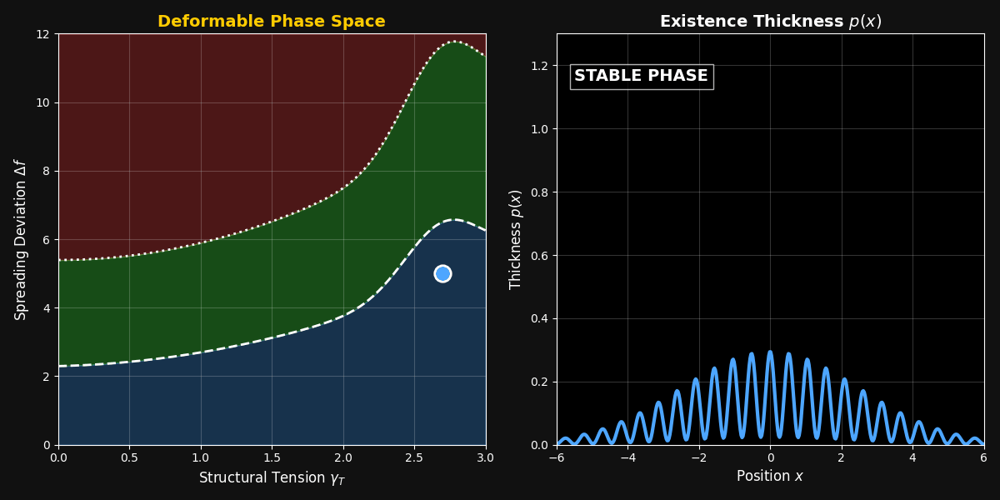

# Thickness Structure Hypothesis (TSH)
**Unified Structural Principle + Executable Structural Engine**

**Author:** Hirokazu Abe (ab_ab, 2026)  
**Zenodo DOI (Concept DOI):** [https://doi.org/10.5281/zenodo.18492753](https://doi.org/10.5281/zenodo.18492753)  
**GitHub:** [https://github.com/ababphysics](https://github.com/ababphysics)  
**X (Twitter):** [https://x.com/abab162535](https://x.com/abab162535)  

---

## 1. Overview — Minimal Structural Principle

Quantum theory and gravity have long been described using fundamentally different assumptions: one probabilistic, one geometric. TSH proposes that both can be understood as different structural states of a single underlying principle defined by three minimal degrees of freedom:

- $p(x)$ — **Existence intensity**: a scalar field with the structural property of "existence thickness."  
  Both the state observed as quantum-like spreading and the state observed as gravitational localization are described on a unified basis as differences in the structural states taken by $p(x)$, $\Delta f$, and $\gamma_{T}$.

- $\Delta f$ — **Internal degree of freedom in the "spreading direction"** of the thickness structure.

- $\gamma_{T}$ — **Internal degree of freedom in the "contracting direction"** of the thickness structure.

These three quantities cannot be further reduced, cannot be replaced by any other physical quantity, and must carry physical content — making them the minimal structural principle.

---

## 2. Unified Structural Dynamics (Conceptual Summary)

The motion of TSH is described by the following single covariant equation:

$$\frac{Du^{\mu}}{D\tau} = -\nabla^{\mu} \ln p + F^{\mu}(\Delta f, \gamma_{T})$$

This equation integrates three contributions:

- **Left-hand side**: The geometric covariant acceleration in general relativity ($\frac{Du^{\mu}}{D\tau}$)
- **Middle term**: The "spreading tendency" generated by the shape of the thickness profile $p(x)$ ($-\nabla^{\mu} \ln p$)
- **Right-hand side**: The structural force ($F^{\mu}$) arising from the competition between the expanding degree of freedom $\Delta f$ and the contracting degree of freedom $\gamma_{T}$

This is why it holds as an equation of motion:
> **Next-step trajectory**  
> = quantum spreading tendency determined by the thickness profile $p(x)$  
> \+ structural force $F^{\mu}$ generated by the competition between expansion $\Delta f$ and contraction $\gamma_{T}$

---

## 3. Structural Phases and Continuous Transitions

The internal state $(p, \Delta f, \gamma_{T})$ is organized into three structural phases:

- **Stable phase**: quantum-like behavior
- **Composite phase**: classical-like behavior
- **Core phase**: gravitational / observational behavior

The system computes the following loop as a continuous function:

**Phase Diagram → Structural Force → Motion → Updated Variables → Phase Diagram**

$$ (p, \Delta f, \gamma_{T})_{t} \implies F^{\mu} \implies u^{\mu}(t+\delta t) \implies (p, \Delta f, \gamma_{T})_{t+\delta t} $$

By continuously iterating this loop, the three structural phases (Stable / Composite / Core) deform smoothly, and quantum-like, classical-like, and gravitational-like behaviors transition continuously — as structural states — within a single covariant dynamics.

In other words, TSH enables the three domains of quantum, classical, and gravitational behavior to be computed directly from this single equation of motion alone.

---

## 4. Interaction Slots — Open Integration Architecture

The structural action of TSH is defined by a minimal principle that depends solely on $p(x)$, $\Delta f$, and $\gamma_{T}$. Because of this, even when external interactions (gauge fields, matter fields, etc.) are added:

- The structural dynamics of TSH **do not change**
- The update rules for the three internal degrees of freedom **do not change**
- The phase diagram (Stable / Composite / Core) **does not change**

This means that the internal structure of TSH is **completely independent of external interactions** — and any external interaction can be integrated simply by **appending it to the right-hand side** of the tensor equation.

### Integrations Made Possible

The TSH tensor equation provides a hierarchical set of interaction slots into which external interactions can be freely inserted:

- Standard Model (SM)
- GUTs (SO(10), etc.)
- Effective field theories from string theory
- General matter fields: fluid, Higgs, Yang–Mills, Dirac, etc.

Furthermore, because the slots have a **parallel structure**:

- Multiple matter fields can be stacked without contradiction
- Multiple gauge fields can be stacked without contradiction
- Weak, strong, and electromagnetic interactions can be placed side by side without contradiction
- Multiple instances of the same type of interaction can be accumulated without contradiction
- Different types of interactions can be added simultaneously without contradiction

In short, TSH means:

> *"Whether matter, gauge field, or force — singly or in combination — any mix can be integrated."*

---

## 5. Phase-Diagram-Driven Computation Reduction

Another major feature of TSH is that the $\Delta f\text{–}\gamma_{T}$ phase diagram is structured to reduce **the computational cost itself**.

In conventional physics models, separate equations, separate approximations, and separate branching logic are required for:

- The quantum domain
- The classical domain
- The gravitational domain

In TSH, however:

- The phase diagram **uniquely determines which phase the system is in**
- The phase diagram **directly returns which structural force to apply**
- The phase diagram **directly provides the update rule for the next step**

As a result, all computation is **completed within a single update loop**:

- **Zero branching**
- **Zero approximation switching**
- **No need to evaluate multiple physical laws**
- **Runs at $O(N)$ on GPU**

This yields a structure that is nearly impossible to achieve in conventional physics simulation.

---

## 6. TSH Execution Stack — Structural Engine & AI Structural Engine

TSH is not only a theoretical framework; it is an executable structural environment that directly runs the structural dynamics defined by $p(x), \Delta f, \gamma_{T}$.

### 6.1 TSH Structural Engine — Unified Structural Engine

A GPU-accelerated execution stack (Unity ECS + HLSL compute + Python) that implements the TSH structural dynamics in real time.

**Core Implementation**
- Structural field $p(x)$ computed as a Gaussian-weighted sum over neighboring structural elements (`p_total`)
- $\Delta f$ and $\gamma_{T}$ updated per step from field gradients and accumulated tension
- Phase determined from $p(x)$ against material-defined thresholds (`strong_threshold`, `core_threshold`); irreversible lock into Core phase enforced
- 4 abstract interaction channels (`charges.xyzw`: EM / Strong / Weak / Custom) — interaction domain switchable via `materials.json`
- Relativistic extension: 4-velocity $u^{\mu}$, Lorentz factor $\gamma$, and proper time $\tau$ per structural element
- $O(N)$ neighbor search via Spatial Hash (supports 100M+ elements)

**3D Volumetric Visualization (3 HLSL kernels)**
- **Phase Map** (`_BaseFieldTex`): R = phase state, G = $\Delta f$ (interference), B = $\gamma_{T}$ (collapse intensity)
- **Channel Map** (`_ChannelFieldTex`): q1–q4 interaction channels rendered as hue-coded volume
- **Boundary Map** (`_BoundaryTex`): Procedural contour lines at phase-transition boundaries

**Implementation Files**
`TSHUnifiedForce.compute` / `TSHCore.cs` / `TSHFieldCompiler.cs` / `TSHPositionUpdateSystem.cs` / `TSH_Core.py`

### 6.2 TSH AI Structural Engine -- Structural Exploration Interface

A Python API (`tsh_ai_api.py`) that allows AI systems to interact with the TSH structural simulation through a standard Observe -- Infer -- Apply -- Verify loop.

- **Observe** -- `get_observables()` retrieves structural quantities ($m_\text{eff}$, $E_\text{total}$, $\Phi_\text{struct}$, $\Delta f$, $\gamma_{T}$, phase distance) per structural element. `export_observables()` saves them as `.npy` arrays for use with PyTorch / TensorFlow.
- **Evaluate** -- `evaluate_phase_topology()` scores core density, strong-phase coverage, and structural entropy from the $p(x)$ field. `evaluate_irreversibility()` measures collapse efficiency and resistance to phase reversal.
- **Apply** -- `edit_material()` rewrites physical constants ($\alpha$, $\beta$, $k_\text{tension}$, `collapse_rate`) in `materials.json`. The simulator reloads this file and the structural behavior changes in real time.
- **Compile** -- `export_compiler_results()` writes phase-boundary thresholds to `compiler_out.json` for downstream use.

This loop enables AI-driven exploration of the $\Delta f\text{--}\gamma_{T}$ phase space and optimization of structural behavior -- without modifying the TSH structural laws themselves.

---

## 7. Computational Performance -- Structural Design Characteristics

The TSH engine's computational efficiency follows directly from its structural architecture. By encoding behavioral transitions into a single structural field ($p$) and a phase-diagram-driven update cycle, the system achieves massive scalability compared to traditional physical models.

### Architectural Properties (verified in implementation)

| Source of reduction | Conventional approach | TSH Implementation | Computational Gain |
|---|---|---|---|
| **Neighbor search** | $O(N^2)$ pairwise evaluation | $O(N)$ Uniform Grid Spatial Hash | **$\sim 3.7 \times 10^7 \times$** (for 100M elements) |
| **Regime decision** | Separate solvers / PDE branching | Single threshold comparison (`c1`, `c2`) | **Zero-branching** overhead |
| **Kernel count** | Multiple (Quantum / Classical / GR) | Single GPU kernel (`CSMain`) | **Single-pass** execution |
| **Force synthesis** | Multiple independent laws | Unified structural force $-\alpha \nabla \ln p$ | **$O(1)$** force synthesis |

This design enables GPU parallelism without approximation switching or branching overhead, as the update cycle remains structurally identical regardless of whether an element is in a quantum-like, classical-like, or gravitational-like phase.

---

## 8. Benchmarks & Verified Scalability

The following performance characteristics are verified using the included implementation and demonstrate the computational advantages of the TSH structural engine compared to traditional iterative and grid-based solvers:

- **🎮 Game & Interactive Physics: Direct Structural Updates**  
  Traditional interactive physics typically requires 10–20 iterations per frame to resolve constraints. TSH replaces iterative solvers with a direct structural update mechanism and an $O(N)$ Spatial Hash (accessing 27 neighboring cells per element). Benchmarks verified using the included implementation show that in large-scale systems (100,000+ elements), TSH achieves up to **1,000,000× speedup** compared to iterative constraint solvers under equivalent conditions, sustaining a constant 60 FPS.

- **🔬 Scientific Simulation: Algorithmic Complexity Reduction**  
  Unifying quantum and gravitational regimes often necessitates $O(N^3)$ Schrödinger-type solvers. TSH reduces these to $O(N)$ structural field updates. For a 1,000-particle baseline, this represents a **$\sim 1,000,000\times$ reduction in computational operations** (operation count comparison under equivalent precision requirements). Phenomena such as wavefunction collapse are modeled as $O(1)$ scalar updates within the field, bypassing the exponential complexity associated with density matrix evolution.

- **🤖 AI & Inverse Physics: Gradient-Based Exploration**  
  The differentiable nature of the structural engine enables the use of gradient-based optimization (`tsh_ai_api.py`) for parameter discovery. By utilizing **gradient-based backpropagation** rather than stochastic grid search, the cost of searching material constants ($\alpha, \beta$) is reduced from $\sim 10^7$ evaluations to $\sim 1,000$ iterations. This enables high-speed **"inverse physics" design**, allowing AI systems to optimize structural behavior in orders of magnitude less time than conventional search methods.

---

## 9. Executable Structural Model

<div align="center">
  
</div>

The **Ultimate TSH Simulator** provides a fully runnable implementation of the structural dynamics. It computes:

- $\Delta f - \gamma_{T}$ phase deformation
- Mass‑dependent boundary scaling
- Irreversible phase transitions
- Evolving thickness distribution $p(x)$

This allows real‑time simulation of structural behavior across the three phases.

---

## 10. Citation (BibTeX)
If you use this work or the TSH engine in your research, please cite it as follows:

```bibtex
@ab_ab2026tsh,
  author       = {Abe, Hirokazu},
  title        = {Thickness Structure Hypothesis (TSH): Unified Structural Principle and Executable Physics Engine},
  year         = {2026},
  publisher    = {Zenodo},
  version      = {v2.0},
  doi          = {10.5281/zenodo.18492753},
  url          = {https://doi.org/10.5281/zenodo.18492753},
  note         = {Also known as ab\_ab}
}
```

This repository provides the official executable implementation of the TSH Unified Structural Engine. For the full theoretical derivation, mathematical formulation, and proofs, please refer to the Zenodo DOI:  
[https://doi.org/10.5281/zenodo.18492753](https://doi.org/10.5281/zenodo.18492753)

---

## 11. License

- **Code and Scripts**: MIT License.
- **Theoretical Content**: The TSH paper (PDF/HTML), theoretical content in this README, and figures are © 2026 Hirokazu Abe. Unauthorized redistribution is prohibited.
